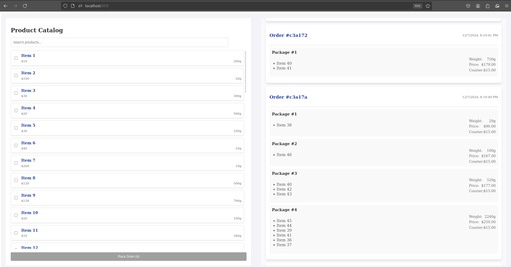

# eCommerce Order Packaging System

This project simulates a product ordering and packaging system. The application allows users to select multiple products, place an order, and see how the selected items are split into packages based on predefined constraints like price limits and courier shipping weight rules.

---


## 🚀 **Features**

- **Product List Display**: Shows all products with checkboxes to select items.
- **Place Order**: Submits selected items to the server for packaging calculation.
- **Package Calculation**: Automatically splits the selected items into packages while adhering to:
  - Maximum total cost of $250 per package for international customs purposes.
  - Even distribution of weight across multiple packages.
- **Courier Charges**: Displays shipping costs based on total weight of each package.

---

## 🛠️ **Tech Stack**

### **Frontend**
- React + Vite
- TypeScript
- Axios
- CSS (Custom Styles)

### **Backend**
- Node.js
- Express.js
- MongoDB
- Mongoose

---

## 🏗️ **Setup Instructions**

Follow these steps to run the project locally:

### **1. Clone the repository**
```bash
git clone https://github.com/fearalert/geek_tech/
cd backend_task
```

---

### **2. Set up Backend**

1. Navigate to the backend directory:
```bash
cd geektech_backend
```

2. Install dependencies:
```bash
npm install
```

3. Start the backend server:
```bash
npm run dev
```

---

### **3. Set up Frontend**

1. Navigate to the frontend directory:
```bash
cd geektech_nodeapp_frontend
```

2. Install dependencies:
```bash
npm install
```

3. Start the frontend development server:
```bash
npm run dev
```

---

### **4. Access the App**

Once both the backend and frontend are running, open your browser and go to:
[http://localhost:5173/](http://localhost:5173/)

---

## 📊 **How It Works**

1. **Load Products**:
   Products are seeded when backend is connected to db and dynamically fetched from the backend and rendered in the product list with their respective prices and weights.

2. **Select Products**:
   Users can select products by clicking the checkboxes.

3. **Place Order**:
   Clicking **Place Order** sends the selected items to the server.

4. **Server Logic**:
   The server splits items into packages based on:
   - Maximum allowed cost per package: **$250**
   - Even weight distribution across multiple packages.
   - Courier cost is calculated based on weight ranges.

5. **View Results**:
   The frontend displays the result in multiple packages with their total weight, price, and shipping costs.

---

## ⚙️ **Backend Schema**

### `Product Schema`

Stores product details like name, price, and weight.

```javascript
const ProductSchema: Schema = new Schema({
  name: { type: String, required: true },
  price: { type: Number, required: true },
  weight: { type: Number, required: true },
});
```

### `Order Schema`

For storing the result of package calculation when an order is placed.

```javascript
const OrderSchema = new Schema<IOrder>({
  selectedItems: {
    type: [String],
    required: true,
  },
  packages: [
    {
      packageNumber: { type: Number, required: true },
      items: { type: [String], required: true },
      totalPrice: { type: Number, required: true },
      totalWeight: { type: Number, required: true },
      courierPrice: { type: Number, required: true },
    },
  ],
  createdAt: {
    type: Date,
    default: Date.now,
  },
});
```

---

## 📦 **API Endpoints**

### 1. **`GET /api/products/get`**
Fetch all the available products in the store.

#### **Request**

```http
GET /api/products/get
```

#### **Response**

```json
[
  {
    "_id": "product_id_1",
    "name": "Item 1",
    "price": 10,
    "weight": 100
  },
  {
    "_id": "product_id_2",
    "name": "Item 2",
    "price": 30,
    "weight": 200
  },
  {
    "_id": "product_id_3",
    "name": "Item 3",
    "price": 40,
    "weight": 300
  }
]
```

---

### 2. **`POST /api/orders/place-order`**
Places an order based on selected items. The backend splits these items into valid packages using a custom logic defined in `utils/calculate.package`. Courier costs are predefined and added to the response.

#### **Request**

##### Body Parameters
```json
{
  "selectedItems": ["product_id_1", "product_id_2"]
}
```

Where:
- `selectedItems`: An array of product IDs selected by the user.

---

#### **Response**

On success, this endpoint will return the calculated order result, including splitting logic into packages:

```json
[
  {
    "packageNumber": 1,
    "items": ["Item 1", "Item 2"],
    "totalPrice": 40,
    "totalWeight": 300,
    "courierPrice": 15
  },
  {
    "packageNumber": 2,
    "items": ["Item 3"],
    "totalPrice": 40,
    "totalWeight": 300,
    "courierPrice": 15
  }
]
```

---

### 3. **`GET /api/orders/get-orders`**
Retrieves all previously placed orders stored in the database.

#### **Request**

```http
GET /api/orders/get-orders
```

#### **Response**

```json
[
  {
    "_id": "order_id_1",
    "selectedItems": ["product_id_1", "product_id_2"],
    "packages": [
      {
        "packageNumber": 1,
        "items": ["Item 1", "Item 2"],
        "totalPrice": 40,
        "totalWeight": 300,
        "courierPrice": 15
      }
    ]
  },
  {
    "_id": "order_id_2",
    "selectedItems": ["product_id_3"],
    "packages": [
      {
        "packageNumber": 1,
        "items": ["Item 3"],
        "totalPrice": 40,
        "totalWeight": 300,
        "courierPrice": 15
      }
    ]
  }
]
```

---

## 📜 **Folder Structure**

```
/geektech_backend
    /src
        /constants
            index.ts
        /controllers
            product.controllers.ts
            order.controllers.ts
        /models
            product.ts
            order.ts
        /routes
            product.routes.ts
            order.routes.ts
        index.ts
    package.json
    package-lock.json
    tsconfig.json

/geektech_nodeapp_frontend
    /public
    /src
        /assets
        /api
            api.ts
        /components
            ProductList.tsx
            ProductList.css
        /types
            types.ts
        index.css
        App.tsx
        App.css
        main.tsx
    .gitignore
    eslint.config.js
    package.json
    package-lock.json
    tsconfig.json
    tsconfig.node.json
    README.md
    vite.config.ts
```

---